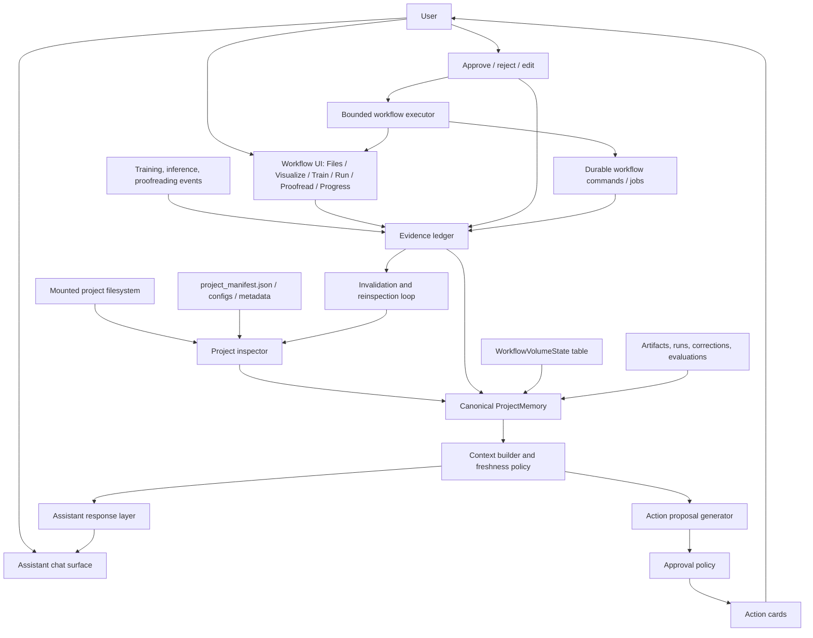

# Agentic Workflow Formalization Report

Date: 2026-05-27

## 1. Executive Summary

Build the seg.bio / PyTC Client assistant as a **workflow-aware, approval-gated project operator** for volumetric biomedical segmentation. The central abstraction should not be chat history. It should be **project memory plus action proposals**. Chat is the conversational surface; project memory is the shared source of truth; action cards bridge intent to bounded app routines; evidence events are the provenance layer that makes the system credible for engineering, science, and a TOCHI-style systems paper.

The paper should call the system a **mixed-initiative workflow agent for iterative biomedical image segmentation**. This is more precise than "chatbot" and more defensible than "autonomous scientist." The product can call it the **Workflow Assistant** or **Segmentation Workflow Assistant**.

The current prototype already has important pieces: workflow sessions, event logs, artifacts, volume states, model runs, correction sets, evaluation records, agent proposals, approval events, action cards, command records, project scanning, and evidence bundle export. The brittle part is that these pieces do not yet form one canonical contract. Project state is spread across `WorkflowSession` columns, `metadata_json.project_context`, `metadata_json.project_observation`, `metadata_json.project_progress_snapshot`, `WorkflowVolumeState`, browser session chat, mounted file records, runtime form state, and inferred project-progress scans. The assistant sometimes answers from a useful but stale synthesis rather than from a documented inspection boundary.

Recommended architecture:

1. Introduce a normalized `ProjectMemory` object as the canonical read model.
2. Make per-volume state first-class and more expressive than the current `ground_truth / needs_proofreading / missing_segmentation` labels.
3. Replace fragmented assistant actions with one typed `WorkflowActionProposal` envelope.
4. Require approval for mutating, expensive, editor-launching, export, and runtime actions.
5. Log every proposal, approval/rejection, execution attempt, artifact mutation, status transition, and evidence basis.
6. Add deterministic invalidation and reinspection rules so the agent knows when memory is fresh enough.
7. Move onboarding from a blank text box to inspect-first guided context elicitation.

This direction is backed by mixed-initiative UI principles: automation should add real value, ask at the right time, expose uncertainty, and leave users in control. Horvitz's mixed-initiative work warns about poor guesses, poor timing, and inadequate user steering; Amershi et al.'s Human-AI Interaction Guidelines emphasize clear system capability, timely updates, efficient correction, and graceful recovery; interactive ML work argues that end-users must participate throughout training and refinement, not merely label data once. In biomedical image analysis, ilastik demonstrates guided interactive learning for non-ML experts, CellProfiler demonstrates modular reproducible pipelines for biologists, OME-Zarr and REMBI show that metadata is not optional, and CAVE / WEBKNOSSOS / VAST show that proofreading and annotation need versioned, queryable state rather than ad hoc edits.

The strongest paper claim is not that the assistant improves segmentation accuracy. The defensible claim is that it improves **workflow coordination** across inspection, volume triage, proofreading, training, inference, evaluation, and evidence capture by making state, proposals, approvals, and provenance explicit.

## 2. Current Prototype Diagnosis

### What exists now

Backend:

- `server_api/workflows/db_models.py` defines useful workflow tables: `WorkflowSession`, `WorkflowEvent`, `WorkflowCommand`, `WorkflowArtifact`, `WorkflowVolumeState`, `WorkflowModelRun`, `WorkflowModelVersion`, `WorkflowCorrectionSet`, `WorkflowEvaluationResult`, `WorkflowRegionHotspot`, `WorkflowAgentPlan`, and `WorkflowAgentStep`.
- `server_api/workflows/router.py` exposes workflow detail, project progress, volume state, overview, recommendations, agent query, proposal approval/rejection, plan approval, evidence export, and evaluation endpoints.
- `_observe_workflow_project()` scans mounted roots using `_scan_project_profile()` and persists a compact `metadata_json.project_observation`.
- `_build_workflow_project_progress()` derives volume rows, writes `metadata_json.project_progress_snapshot`, and syncs `WorkflowVolumeState`.
- `_requires_action_approval()` and `_infer_action_risk()` already classify actions into read-only, form-prefill, editor, runtime, workflow-record, workspace, and export risk classes.
- `bundle_export.py` exports events, artifacts, model runs, model versions, correction sets, evaluations, hotspots, volume states, agent plans, and discovered paths.

Frontend:

- `client/src/components/Chatbot.js` routes workflow-like messages to the workflow agent, renders assistant action cards, command cards, proposal cards, traces, and sanitizes stale workflow cards.
- `client/src/contexts/WorkflowContext.js` centralizes workflow refreshes, action effects, proposal approval, evidence refresh, progress refresh, and runtime handoff.
- `client/src/views/ProjectProgress.js` provides the current volume tracker and manual status updates.
- Files, Visualize, Train Model, Run Model, Proofread, and Progress are already recognizable workflow stages.

### Where it is strong

- It has an approval-gated path for significant proposals.
- It has an append-only event model and typed artifact/run/correction/evaluation tables.
- It can inspect mounted project roots and parse `project_manifest.json`.
- It can derive volume-level progress for the MitoEM2 and TapeReader fixtures.
- It has started separating visible chat from traces/action cards.
- It has durable command records for approved training, which is the right direction for long-running work.
- It already avoids arbitrary shell execution as the primary assistant execution model.

### Where it is brittle

- **No canonical memory contract.** Project facts live in multiple mutable places: workflow columns, `metadata_json.project_context`, `project_observation`, `project_progress_snapshot`, persisted `WorkflowVolumeState`, mounted file records, and UI state.
- **Progress terms are too coarse and inconsistent.** Backend uses `ground_truth`, `needs_proofreading`, `missing_segmentation`, `ignored`; the target model needs `image_only`, `draft_segmentation`, `proofread_ground_truth`, `queued_for_inference`, `prediction_ready`, etc.
- **Action semantics are split.** There are `AgentChatAction`, `AgentCommandBlock`, `agent.proposal_created` events, `WorkflowCommand`, direct client effects, and runtime actions. The user sees cards, but engineering has several execution paths.
- **Freshness is implicit.** `_observe_workflow_project()` records `observed_at`, and progress records `generated_at`, but there is no shared invalidation policy or "fresh enough for this answer" test.
- **The semantic router is heuristic plus optional local LLM classification.** It is useful, but the prompt and routing code are a large handwritten policy surface that can drift from action preconditions.
- **Training and inference still select from paths/forms, not a canonical volume set.** This makes it easy to accidentally train on draft masks or forget image-only targets.
- **Approval records do not always produce complete provenance.** Approval is logged, but cards need to record the evidence basis, selected volumes, expected outputs, user-visible risks, command id, resulting artifacts, and postcondition checks.
- **Onboarding still depends too much on chat.** The scanner finds useful facts, but the first-run experience should be a guided correction form backed by detected facts.

### Fix first

1. Define `ProjectMemory` and populate it from existing tables/scans.
2. Make `WorkflowVolumeState` the canonical volume state source, with derived scans only proposing updates.
3. Introduce one `WorkflowActionProposal` schema and map existing cards to it.
4. Add invalidation rules and visible freshness markers.
5. Make Progress row actions drive Train/Run/Proofread selections.

## 3. Literature-Backed Design Principles

| Principle                                                 | Evidence                                                                                                                                                                                                                                                                                                                                                                                                                         | App Implication                                                                                                                                                              | Priority |
| --------------------------------------------------------- | -------------------------------------------------------------------------------------------------------------------------------------------------------------------------------------------------------------------------------------------------------------------------------------------------------------------------------------------------------------------------------------------------------------------------------- | ---------------------------------------------------------------------------------------------------------------------------------------------------------------------------- | -------- |
| Use mixed initiative, not hidden autonomy                 | Horvitz identifies common agent failures: poor goal guesses, poor timing, weak user guidance, and weak recovery; effective systems combine direct manipulation and automated services. [Horvitz 1999](https://www.microsoft.com/en-us/research/wp-content/uploads/2016/11/chi99horvitz.pdf)                                                                                                                                      | The assistant proposes bounded actions and asks for approval when cost or mutation matters. Users can edit facts and reject proposals.                                       | High     |
| Show capabilities, uncertainty, and recovery              | Amershi et al. organize Human-AI Interaction Guidelines around initial expectations, interaction, errors, and long-term adaptation. [Amershi et al. 2019](https://www.microsoft.com/en-us/research/publication/guidelines-for-human-ai-interaction/)                                                                                                                                                                             | Each answer should include one concrete next move, uncertainty when facts are inferred, and correction controls for wrong project facts.                                     | High     |
| Keep humans inside the learning loop                      | Interactive ML research argues end-users shape systems through iterative interaction, not just one-time labeling. [Amershi et al. 2014](https://ojs.aaai.org/aimagazine/index.php/aimagazine/article/view/2513/0)                                                                                                                                                                                                                | Proofreading, promotion to ground truth, retraining, and evaluation should be explicit loop stages with visible evidence.                                                    | High     |
| Ask concrete questions instead of blank prompts           | Mixed-initiative and HAI guidelines both favor timely, bounded clarification over vague handoff.                                                                                                                                                                                                                                                                                                                                 | First-run intake should display detected facts and ask short editable questions: modality, target, label type, voxel size, which masks are trusted.                          | High     |
| Reproducible workflows need durable provenance            | W3C PROV models entities, activities, agents, and derivation. [PROV-DM](https://www.w3.org/TR/prov-dm/); CWLProv distinguishes prospective and retrospective provenance. [CWLProv review](https://academic.oup.com/gigascience/article/doi/10.1093/gigascience/giz095/5611001)                                                                                                                                                   | Use an append-only evidence ledger for observations, proposals, approvals, executions, artifacts, metrics, and status transitions.                                           | High     |
| Bioimage data needs metadata, not just files              | REMBI recommends metadata sufficient for reuse of biological images. [REMBI](https://www.nature.com/articles/s41592-021-01166-8); OME-Zarr stores scalable image arrays with multiscale metadata. [OME-Zarr paper](https://pmc.ncbi.nlm.nih.gov/articles/PMC9980008/) and [spec](https://ngff.openmicroscopy.org/0.5/index.html)                                                                                                 | Project memory should store modality, voxel size, axes, dtype, shape, channel/label semantics, and metadata source/confidence.                                               | High     |
| Biologists adopt guided workflow tools                    | ilastik emphasizes interactive labeling and immediate feedback for non-ML experts. [ilastik](https://www.ilastik.org/); CellProfiler emphasizes modular reproducible pipelines designed for biologists. [CellProfiler 3.0](https://pmc.ncbi.nlm.nih.gov/articles/PMC6029841/)                                                                                                                                                    | The assistant should feel like guided workflow software, not a command-line agent in a chat drawer.                                                                          | High     |
| Proofreading is stateful and versioned                    | CAVE supports reproducible analysis while proofreading changes segmentation state. [CAVE](https://pmc.ncbi.nlm.nih.gov/articles/PMC12074985/); WEBKNOSSOS supports merge/split and voxel relabeling workflows. [WEBKNOSSOS](https://docs.webknossos.org/webknossos/proofreading/index.html); VAST targets large-volume annotation and segmentation editing. [VAST](https://pmc.ncbi.nlm.nih.gov/articles/PMC6198149/)            | Proofread masks should become versioned correction artifacts with edited regions, source masks, and promotion decisions.                                                     | High     |
| Agentic coding patterns transfer only as control patterns | Codex and Claude Code-style tools inspect project context, plan, call typed tools, require approvals, and preserve traces. [Codex help](https://help.openai.com/en/articles/11096431), [Claude Code subagents](https://code.claude.com/docs/en/sub-agents), [GitHub Copilot coding agent](https://github.blog/developer-skills/github/less-todo-more-done-the-difference-between-coding-agent-and-agent-mode-in-github-copilot/) | Transfer inspect-plan-act, typed tools, approval gates, traces, and resumability. Do not transfer arbitrary shell execution or code-diff metaphors as the main user surface. | Medium   |
| Experiment tracking needs lineage and versioning          | MLflow model registry tracks model lineage and stage transitions. [MLflow](https://mlflow.org/docs/2.4.1/model-registry.html); DVC emphasizes data, code, params, metrics, and artifacts for reproducibility. [DVC](https://dvc.org/doc/use-cases/experiment-tracking)                                                                                                                                                           | Training/inference/evaluation records should capture configs, inputs, outputs, checkpoints, metrics, code/library versions when available, and data membership.              | Medium   |

## 4. Proposed Agent Architecture



### Components

- **Project inspector:** read-only scanner for mounted roots, manifests, configs, dimensions, dtypes, axes, voxel sizes, checkpoints, predictions, logs, metrics, and proofreading exports.
- **Project memory:** normalized read model assembled from tables and scans. It is the source of truth for assistant answers.
- **Retrieval/context layer:** selects only facts relevant to the user query and records freshness. It should never dump raw JSON into chat.
- **Assistant response layer:** writes short, normal answers with one next move and uncertainty when needed.
- **Trace/evidence layer:** expandable "What I checked" records: scan time, paths, manifest fields, volume counts, status evidence, blockers.
- **Action proposal generator:** emits typed cards with scope, affected volumes, inputs, outputs, risk/cost, evidence basis, preconditions, and postconditions.
- **Approval policy:** read-only navigation can run directly; editor, mutating, export, stop, train, inference, and state transitions need approval.
- **Bounded workflow executor:** calls app routines only: mount, view, prefill form, open proofread, start/stop training, start/stop inference, compute evaluation, export bundle, update volume status.
- **Artifact/provenance ledger:** append-only event stream plus typed tables for artifacts, runs, correction sets, model versions, evaluations, and volume transitions.
- **Invalidation loop:** file changes, status edits, job events, proofread saves, app resume, and freshness-sensitive queries mark memory stale and trigger targeted reinspection.

## 5. Project Memory Schema

```json
{
  "schema_version": "seg-workflow-project-memory/v1",
  "project": {
    "workflow_id": 123,
    "title": "Yixiao TapeReader XRI Case Study",
    "roots": [
      {
        "path": "/home/weidf/demo_data/yixiao_tapereader_xri_case_study",
        "mounted_root_id": 7,
        "source": "mounted_files",
        "last_scanned_at": "2026-05-27T..."
      }
    ],
    "dataset_family": "TapeReader / PT37_round2",
    "task_family": "xri_fibre_instance_segmentation",
    "imaging_modality": {
      "value": "X-ray / XRI volumetric microscopy",
      "source": "project_manifest.json",
      "confirmed_by_user": false
    },
    "target_structure": {
      "value": "CytoTape fibres",
      "source": "project_manifest.json",
      "confirmed_by_user": false
    },
    "voxel_size_zyx_nm": {
      "value": [40, 16.3, 16.3],
      "source": "project_manifest.json",
      "confirmed_by_user": false
    },
    "label_semantics": {
      "kind": "instance_labels",
      "background_value": 0,
      "partial_annotation_policy": "unknown"
    }
  },
  "task_preset": {
    "id": "xri_tapereader_fibre",
    "expected_inputs": ["raw_volume", "instance_mask", "pytc_config"],
    "expected_outputs": [
      "prediction_mask",
      "correction_set",
      "trained_checkpoint"
    ],
    "evaluation_metrics": [
      "instance_count_delta",
      "mask_iou",
      "object_precision_recall"
    ],
    "safe_defaults_profile": "app_compatible_sanity"
  },
  "volumes": [
    {
      "volume_id": "5_1",
      "name": "PT37_round2_5_1",
      "image_path": "data/raw/5_1/5_1-xri-raw.tif",
      "label_path": "data/seg/5_1/5_1-mask.tif",
      "prediction_path": null,
      "corrected_mask_path": null,
      "status": "needs_proofreading",
      "status_source": "project_manifest",
      "status_confidence": 1.0,
      "eligible_for_training": false,
      "eligible_for_inference": false,
      "shape_zyx": [40, 500, 500],
      "dtype": { "image": "uint16", "label": "int64" },
      "label_stats": { "instance_label_count": 134 },
      "regions": [
        {
          "region_id": "bbox:z0-39_y0-499_x0-499",
          "proofreading_status": "unreviewed",
          "valid_mask_path": null
        }
      ],
      "last_verified_at": "2026-05-27T...",
      "evidence_event_ids": [501, 502]
    }
  ],
  "artifact_index": [
    {
      "artifact_id": 21,
      "type": "config",
      "role": "app_compatible_training_config",
      "path": "configs/TapeReader-Fiber-BCS-AppCompat-Sanity.yaml",
      "checksum": "sha256:...",
      "exists": true,
      "source_event_id": 77
    }
  ],
  "run_history": [
    {
      "run_id": "train-20260527-001",
      "type": "training",
      "status": "completed",
      "input_volume_ids": ["1", "2", "3", "4_1", "4_2", "4_3"],
      "config_artifact_id": 21,
      "output_artifact_ids": [31],
      "checkpoint_artifact_id": 32,
      "metrics": {},
      "started_at": "...",
      "completed_at": "..."
    }
  ],
  "proofreading_history": [
    {
      "correction_set_id": 9,
      "source_volume_id": "5_1",
      "source_mask_path": "data/seg/5_1/5_1-mask.tif",
      "corrected_mask_path": "outputs/corrections/5_1-corrected.tif",
      "edit_count": 14,
      "region_count": 3,
      "promoted_to_ground_truth": false,
      "source_event_id": 184
    }
  ],
  "evaluation_history": [
    {
      "evaluation_id": 4,
      "baseline_run_id": 12,
      "candidate_run_id": 15,
      "reference_artifact_id": 40,
      "metrics": { "mask_iou": 0.81 },
      "report_path": "outputs/evaluation/report.json"
    }
  ],
  "user_confirmations": [
    {
      "field": "training_policy",
      "value": "train only on proofread_ground_truth",
      "confirmed_by": "user",
      "event_id": 210,
      "confirmed_at": "..."
    }
  ],
  "evidence_events": [
    {
      "event_id": 501,
      "event_type": "project.observed",
      "actor": "system",
      "summary": "Read project manifest and found 10 tracked XRI volumes.",
      "created_at": "..."
    }
  ],
  "freshness": {
    "project_tree": {
      "state": "fresh",
      "observed_at": "...",
      "invalidated_by": null
    },
    "volume_states": { "state": "fresh", "observed_at": "..." },
    "runtime": { "state": "stale", "reason": "training job completed" },
    "assistant_context": {
      "built_at": "...",
      "source_event_high_watermark": 501
    }
  }
}
```

## 6. Volume And Workflow State Machine

Use the following canonical states. Keep legacy labels as aliases during migration:

| Canonical state          | Meaning                                                                   | Legacy alias           |
| ------------------------ | ------------------------------------------------------------------------- | ---------------------- |
| `image_only`             | Image exists; no usable label/prediction registered.                      | `missing_segmentation` |
| `draft_segmentation`     | Segmentation exists but trust status is unknown or imported from a model. | none                   |
| `needs_proofreading`     | Draft or prediction is explicitly queued for human review.                | `needs_proofreading`   |
| `proofread_ground_truth` | Human-confirmed training/evaluation reference.                            | `ground_truth`         |
| `training_candidate`     | Selected for a training run but not necessarily all project ground truth. | none                   |
| `queued_for_inference`   | Selected target for inference.                                            | none                   |
| `prediction_ready`       | Inference output exists and can be viewed/proofread/evaluated.            | none                   |
| `ignored`                | Intentionally excluded.                                                   | `ignored`              |

### Transition policy

| From                     | To                       | Actor                  | Evidence required                                    | Approval                                   |
| ------------------------ | ------------------------ | ---------------------- | ---------------------------------------------------- | ------------------------------------------ |
| unknown                  | `image_only`             | inspector              | readable image artifact, no matching mask/prediction | no                                         |
| unknown                  | `draft_segmentation`     | inspector              | image plus mask/prediction, source not confirmed     | no                                         |
| unknown                  | `proofread_ground_truth` | manifest/importer/user | manifest status, path marker, or user confirmation   | user confirmation recommended              |
| `draft_segmentation`     | `needs_proofreading`     | agent/user             | draft mask path and image path                       | no if just queueing; yes if writing status |
| `needs_proofreading`     | `proofread_ground_truth` | user                   | saved correction set or explicit "mark fully good"   | yes                                        |
| `image_only`             | `queued_for_inference`   | user/agent             | selected image, checkpoint/config readiness          | yes                                        |
| `queued_for_inference`   | `prediction_ready`       | executor               | completed inference run and output artifact          | no, system postcondition                   |
| `prediction_ready`       | `needs_proofreading`     | agent/user             | prediction artifact exists                           | no if queueing; yes if writing status      |
| `proofread_ground_truth` | `training_candidate`     | agent/user             | selected training set, config, training policy       | yes                                        |
| any                      | `ignored`                | user                   | explicit user exclusion reason                       | yes                                        |
| `ignored`                | previous state           | user                   | undo event or selected new status                    | yes                                        |

Partial proofreading should be represented as region-level state, not by pretending the whole volume is fully good. Add `volume_regions` or metadata entries with `bbox_zyx`, `valid_mask_path`, `proofreading_status`, `reviewer`, `source_event_id`, and `promoted_at`. Training eligibility for partially proofread volumes requires a valid mask or an explicit region list.

## 7. Action Card Specification

All cards should use one envelope:

```json
{
  "proposal_id": "uuid",
  "action_type": "start_training",
  "plain_language_summary": "Train on 6 confirmed XRI fibre masks.",
  "affected_volume_ids": ["1", "2", "3", "4_1", "4_2", "4_3"],
  "inputs": [
    {
      "role": "config",
      "path": "configs/TapeReader-Fiber-BCS-AppCompat-Sanity.yaml"
    }
  ],
  "outputs": [{ "role": "checkpoint", "planned_path": "outputs/training/..." }],
  "risk_level": "runs_job",
  "requires_approval": true,
  "estimated_duration": "unknown",
  "cost_notes": ["uses GPU if available", "writes training outputs"],
  "preconditions": [{ "id": "training_set", "status": "passed" }],
  "evidence_basis": [{ "event_id": 501, "label": "manifest volume split" }],
  "review_details": { "config_diff": null, "selected_volume_count": 6 },
  "on_approve": { "executor": "workflow.start_training" },
  "on_reject": { "write_event": "agent.proposal_rejected" },
  "postconditions": [
    "model_run row",
    "checkpoint artifact",
    "training completed/failed event"
  ]
}
```

Required card types:

| Type                       | Required fields                                                                                       | Approval behavior                                                   |
| -------------------------- | ----------------------------------------------------------------------------------------------------- | ------------------------------------------------------------------- |
| `visualize_data`           | image path, optional label/prediction path, voxel scale, source volume                                | no approval unless it changes saved project state                   |
| `choose_change_data`       | proposed image/label/config paths, source evidence, fields to change                                  | approval if it writes workflow memory; no approval for form prefill |
| `open_progress`            | summary counts, stale/fresh marker                                                                    | no approval                                                         |
| `start_training`           | training volumes, excluded volumes, config, labels/corrections, output/log paths, expected checkpoint | approval required                                                   |
| `start_inference`          | target volumes, checkpoint, config, output registration plan                                          | approval required                                                   |
| `queue_proofreading`       | volumes, masks/predictions, priority/evidence                                                         | approval if status is written; no approval for opening view         |
| `mark_volume_status`       | old/new state, volume ids, reason, reversibility                                                      | approval required                                                   |
| `export_corrected_masks`   | source session, output path, selected volumes/regions                                                 | approval required                                                   |
| `evaluate_compare_results` | baseline, candidate, reference, metrics, report path                                                  | approval required if it writes metrics/artifacts                    |
| `export_evidence_bundle`   | included tables/artifacts, copy limit, output path                                                    | approval required                                                   |

Cards should show a short summary and compact affected-volume list. Long paths, full volume arrays, config snippets, and logs belong behind "Review details." Every approval/rejection/execution must write a workflow event.

## 8. Guided Context Elicitation

After mounting a project:

1. Inspect project tree, manifest, configs, checkpoints, image/mask/prediction roles, and basic metadata.
2. Show detected facts as editable rows: project title, modality, target structure, voxel size, label type, volume count, trusted masks, draft masks, image-only targets, candidate config.
3. Ask only concrete unresolved questions.
4. Persist corrections into project memory as user confirmations.
5. Generate first recommended actions from the resulting memory.

Example first-run questions:

- "I found 10 XRI volumes: 6 marked ground truth, 2 draft masks, 2 image-only. Is that split correct?"
- "Are masks in `data/seg` instance labels, binary masks, affinities, or something else?"
- "Should training use only confirmed/proofread masks?"
- "Voxel size appears to be z,y,x = 40,16.3,16.3 nm. Confirm or edit?"

Workflow-family prompts:

| Family                             | Ask                                                                                                                              |
| ---------------------------------- | -------------------------------------------------------------------------------------------------------------------------------- |
| mitochondria semantic segmentation | target class, binary/semantic label convention, voxel size, trusted labels, expected metric such as Dice/IoU                     |
| mitochondria instance segmentation | instance id semantics, touching-object handling, AP/object metrics, proofread versus draft masks                                 |
| XRI fibre / TapeReader             | paper-faithful config versus app-compatible config, instance mask semantics, preprocessing/tiled CLAHE status, inference targets |
| affinity-heavy neuron segmentation | affinity target axes, watershed/agglomeration outputs, valid masks/partial labels, split/merge proofreading policy               |
| synapse/cleft segmentation         | cleft versus pre/post labels, class imbalance strategy, evaluation reference, region-level review                                |

Voice input should map to the same bounded questions and cards. Corrections should be stored as `user_confirmations`, not just chat text.

## 9. Case Study-Specific Requirements

### Case 1: MitoEM2-style progress workflow

Local fixture: `/home/weidf/demo_data/mitoem2_progress_demo`.

Expected initial state from `project_manifest.json`:

- 6 HDF5 smoke volumes.
- 2 `ground_truth` / `proofread_ground_truth`.
- 2 `needs_proofreading`.
- 2 `missing_segmentation` / `image_only`.
- Voxel size z,y,x = 30,8,8 nm.
- Config: `configs/MitoEM2-Pyra-Demo-BC.yaml`.

Agent requirements:

- Know that curated masks can train.
- Know draft masks must not silently train.
- Propose proofreading for the two draft volumes.
- Propose inference for the two image-only targets after a checkpoint exists.
- Use MitoEM/MitoEM2 literature to explain complex 3D mitochondria instance segmentation and object-level evaluation, without claiming this smoke fixture is the full benchmark. MitoEM introduced a large-scale 3D mitochondria instance dataset and AP-style evaluation for complex mitochondria. [MitoEM](https://pmc.ncbi.nlm.nih.gov/articles/PMC7713709/). MitoEM2.0 expands challenging 3D mitochondria instance segmentation settings. [MitoEM2.0](https://pmc.ncbi.nlm.nih.gov/articles/PMC12927526/).

Paper evidence:

- Volume-state transition timeline.
- Training-set membership from confirmed masks.
- Proofreading promotion events.
- Inference target selection and output registration.

### Case 2: Yixiao / TapeReader XRI fibre workflow

Local fixture: `/home/weidf/demo_data/yixiao_tapereader_xri_case_study`.

Expected initial state:

- 10 tracked XRI volumes.
- 6 confirmed ground-truth masks: `1`, `2`, `3`, `4_1`, `4_2`, `4_3`.
- 2 draft masks needing proofreading: `5_1`, `5_2`.
- 2 image-only inference targets: `6_1`, `6_2`.
- Voxel size z,y,x = 40,16.3,16.3 nm.
- App-compatible config: `configs/TapeReader-Fiber-BCS-AppCompat-Sanity.yaml`.
- Paper-faithful config: `configs/TapeReader-Fiber-BCS-Original-Barcode.yaml`.
- Reference pipeline: [TapeReader](https://github.com/LinghuLab/TapeReader), preprint DOI [10.1101/2025.05.10.653182](https://www.biorxiv.org/content/10.1101/2025.05.10.653182v1).

Agent requirements:

- Preserve distinction between paper-faithful TapeReader semantics and current PyTC app-compatible fallback.
- Train only on the 6 confirmed masks unless the user explicitly promotes proofread drafts.
- Queue `5_1` and `5_2` for proofreading.
- Queue `6_1` and `6_2` for inference after a model is available.
- Explain what it has inspected: manifest, active paths, config choice, volume split, voxel size.

Paper evidence:

- Demonstrates non-EM, non-mitochondria workflow adaptation.
- Shows project-memory value because the training set is not simply "all masks in folder."
- Shows why domain-specific presets matter.

### Case 3 recommendation: CREMI affinity-heavy neuron segmentation

Recommend **CREMI-style affinity-heavy neuron segmentation** as the third paper case, with a smaller local fixture for reliability. Lucchi++ is useful as an onboarding demo, but it overlaps too much with the mitochondria story. CREMI stresses different agent capabilities:

- affinity labels rather than simple binary/instance masks;
- partial annotations and valid-mask supervision;
- split/merge proofreading semantics;
- anisotropic volume metadata;
- evaluation that depends on connectomics-style topology, not just pixel IoU;
- need to distinguish raw image, affinity prediction, watershed/agglomeration, and proofread segmentation artifacts.

This case lets the paper show that the assistant is a workflow formalization layer, not a filename heuristic for masks. It also connects to PyTorch Connectomics' broader scope: EM connectomics, semantic and instance segmentation, multi-task and semi-supervised learning. [PyTorch Connectomics docs](https://connectomics.readthedocs.io/) and [paper](https://arxiv.org/abs/2112.05754).

Minimum fixture:

- 3 to 5 small CREMI/SNEMI-like HDF5 or Zarr volumes.
- At least one confirmed ground-truth/valid-mask region.
- One predicted affinity/segmentation output needing split/merge proofreading.
- One image-only target.
- Config with affinity outputs and valid-mask support.

Agent behaviors it exercises:

- asks label-semantics questions;
- blocks training when valid masks are missing for partial labels;
- explains that `prediction_ready` may be affinities plus postprocessed segmentation;
- proposes split/merge proofreading instead of generic mask painting;
- records region-level proofreading and valid-mask provenance.

## 10. Evaluation Plan For The Paper

Participant profile:

- 8 to 12 biomedical image analysts, connectomics researchers, or biologists with segmentation experience.
- Include both PyTC-experienced and PyTC-naive users if possible.

Study design:

- Within-subject comparison between current manual UI workflow and workflow-assistant condition, or between baseline assistant and formalized project-memory/action-card assistant.
- Use MitoEM2 and TapeReader tasks; reserve CREMI-style task for transfer/generalization if the fixture is stable.

Tasks:

1. Mount an unfamiliar project and identify usable training masks.
2. Open a draft segmentation for review.
3. Mark/proofread/promote a corrected mask.
4. Configure training from confirmed masks only.
5. Run or stage inference on image-only volumes.
6. Compute or inspect before/after evidence.
7. Export an evidence bundle.

Data to log:

- time to correct project understanding;
- number of wrong volume-status decisions;
- number of manual path selections;
- proposal approval/rejection rate;
- cards edited before approval;
- recovery from wrong assistant suggestion;
- event completeness: inputs, outputs, artifacts, config, selected volumes;
- subjective NASA-TLX or lightweight workload rating;
- interview-coded themes: trust, orientation, controllability, scientific confidence.

Success criteria:

- Users can correctly identify training/proofreading/inference sets faster or with fewer errors.
- Users understand why an action is proposed and what it will affect.
- Evidence bundles reconstruct the workflow without relying on chat memory.
- Users can correct wrong auto-detected facts and see those corrections persist.

Defensible claims:

- Improves coordination and visibility in iterative segmentation workflows.
- Reduces manual translation between file organization, UI forms, and workflow stages.
- Provides approval-gated bounded routines with provenance.
- Supports paper-grade reconstruction of workflow decisions.

Claims to avoid without stronger evidence:

- Improves biological segmentation accuracy.
- Fully automates expert proofreading.
- Generalizes to all microscopy modalities.
- Guarantees scientific validity.
- Safely runs arbitrary pipelines.

## 11. Engineering Roadmap

### Immediate fixes

| Item                                      | User value                       | Backend                                                                           | Frontend                                 | Verification                                   | Paper relevance        |
| ----------------------------------------- | -------------------------------- | --------------------------------------------------------------------------------- | ---------------------------------------- | ---------------------------------------------- | ---------------------- |
| Add `ProjectMemory` read endpoint         | assistant answers from one state | compose workflow, events, volume states, artifacts, runs, observations, freshness | show memory/debug panel and trace source | unit tests with MitoEM2/TapeReader manifests   | core architecture      |
| Migrate volume states to canonical labels | avoids training on drafts        | add aliases/migration from `ground_truth`/`missing_segmentation`                  | update Progress labels and filters       | fixture tests for 2/2/2 and 6/2/2 splits       | case-study correctness |
| One action proposal envelope              | simpler approval model           | add `workflow_action_proposals` or typed event payload schema                     | render one card component by type        | tests for approve/reject/execution event chain | HAI/provenance claim   |
| Freshness policy                          | fewer stale answers              | add invalidation markers for scan, progress, runtime, proofreading                | show stale badge and refresh action      | tests for job complete/edit save/app resume    | credibility            |
| Guided intake from detected facts         | less blank-page anxiety          | expose detected facts and confirmation writes                                     | first-run checklist/editor               | Cypress/manual demo script                     | user study task        |

### Paper-demo requirements

| Item                               | User value                | Backend                                                   | Frontend                                 | Verification        | Paper relevance   |
| ---------------------------------- | ------------------------- | --------------------------------------------------------- | ---------------------------------------- | ------------------- | ----------------- |
| Training set from volume states    | correct data selection    | action preflight selects `proofread_ground_truth` only    | card shows included/excluded volumes     | fixture tests       | central demo      |
| Inference queue from volume states | clear targets             | action preflight selects `image_only` or selected targets | Run Model shows target volume list       | fixture tests       | progress workflow |
| Proofreading promotion             | trustworthy labels        | correction-set to status transition with approval         | Proofread/Progress "promote" action      | event/artifact test | HITL loop         |
| Evidence bundle completeness check | reconstructable workflows | post-export validator                                     | export result card                       | bundle schema test  | paper artifact    |
| TapeReader preset                  | domain-specific behavior  | preset metadata and config distinction                    | intake card and training/inference cards | fixture test        | second case       |

### Production-quality requirements

| Item                                    | User value                | Backend                                               | Frontend                   | Verification                | Paper relevance  |
| --------------------------------------- | ------------------------- | ----------------------------------------------------- | -------------------------- | --------------------------- | ---------------- |
| Durable job runner for train/infer      | reliable long jobs        | command leases, status polling, retries, cancellation | status near Train/Run tabs | integration tests           | robustness       |
| Artifact checksums and dimension probes | reproducibility           | checksum/shape/dtype jobs                             | details disclosure         | sample HDF5/TIFF/Zarr tests | provenance       |
| Region-level proofreading               | partial-label correctness | `WorkflowVolumeRegionState` or equivalent             | region queue UI            | proofread fixture           | CREMI case       |
| Config/run manifest writer              | reproducible ML           | save exact config, data membership, environment hints | review details             | golden manifest tests       | scientific rigor |
| Role-specific permission modes          | safer autonomy            | policy table in backend                               | card labels and settings   | approval tests              | mixed initiative |

### Future/research extensions

- viewer-derived observations or screenshots, explicitly marked as user/viewer-derived rather than filesystem truth;
- active-learning queues based on uncertainty/hotspot metrics;
- integration with OME-Zarr metadata and REMBI export templates;
- collaboration/multi-user review state;
- model registry aliases for accepted checkpoints;
- CAVE/WEBKNOSSOS-style versioned segmentation backends for large connectomics datasets.

## 12. Open Questions

- What database shape should `ProjectMemory` take: materialized table, view endpoint, or versioned JSON snapshot plus normalized child tables?
- Should `ProjectMemory` be persisted after every event or rebuilt on demand with cache invalidation?
- What volume state vocabulary should be exposed to biologists versus stored internally?
- What is the minimum reliable dimension/dtype probe set for HDF5, TIFF, NIfTI, N5, and OME-Zarr?
- How should app-compatible PyTC configs represent multi-volume training without fragile symlink directories?
- What proofread edit granularity is feasible in the current Proofread implementation: mask save count, instance decisions, voxel edits, or region bounding boxes?
- Should the third paper case be CREMI now, or should CREMI be scoped as future work while Lucchi++ serves as the stable third demo?
- What runtime environment metadata can be captured reliably on demo.seg.bio without overpromising reproducibility?
- How much of the evidence bundle should copy artifacts versus record paths, checksums, and missing-file status?

## Final Recommendation

Build the assistant as a workflow-aware, approval-gated project operator. The central abstraction is not chat history; it is project memory plus action proposals. Chat is the conversational surface. Project memory is the source of truth. Action cards are the bridge from intent to bounded execution. Evidence events are the paper-grade provenance layer.
